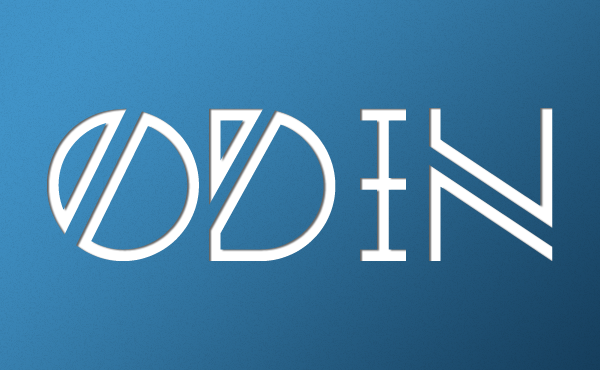

<p align="center">
    
    <br/>
    A fast, concise, readable, pragmatic and open sourced programming language.
    <br/>
    <br/>
    <a href="https://github.com/odin-lang/odin/releases/latest">
        
    </a>
    <a href="https://github.com/odin-lang/odin/releases/latest">
        
    </a>
    <br>
    <a href="https://discord.gg/hnwN2Rj">
        
    </a>
    <a href="https://github.com/odin-lang/odin/actions">
        
    </a>
</p>

# The Odin Programming Language

The Odin programming language is fast, concise, readable, pragmatic and open sourced. It is designed with the intent of replacing C with the following goals:
* simplicity
* high performance
* built for modern systems
* joy of programming

Website: [https://odin-lang.org/](https://odin-lang.org/)

```odin
package main

import "core:fmt"

main :: proc() {
	program := "+ + * 😃 - /";
	accumulator := 0;

	for token in program {
		switch token {
		case '+': accumulator += 1;
		case '-': accumulator -= 1;
		case '*': accumulator *= 2;
		case '/': accumulator /= 2;
		case '😃': accumulator *= accumulator;
		case: // Ignore everything else
		}
	}

	fmt.printf("The program \"%s\" calculates the value %d\n",
	           program, accumulator);
}

```


## Documentation

#### [Getting Started](https://odin-lang.org/docs/install)

Instructions for downloading and install the Odin compiler and libraries.

### Learning Odin

#### [Overview of Odin](https://odin-lang.org/docs/overview)

An overview of the Odin programming language.

#### [Frequently Asked Questions (FAQ)](https://odin-lang.org/docs/faq)

Answers to common questions about Odin.

#### [The Odin Wiki](https://github.com/odin-lang/Odin/wiki)

A wiki maintained by the Odin community.

#### [Odin Discord](https://discord.gg/sVBPHEv)

Get live support and talk with other odiners on the Odin Discord.

### References

#### [Language Specification](https://odin-lang.org/ref/spec)

The official Odin Language specification.

### Articles

#### [The Odin Blog](https://odin-lang.org/blog)

The official blog of the Odin programming language, featuring announcements, news, and in-depth articles by the Odin team and guests.

## Setup

Odin only supports x86-64 at the moment (64-bit), relies on LLVM for code generation and an external linker.

In addition, the following platform-specific steps are necessary:

- Windows
    * Have Visual Studio installed (MSVC 2010 or later, for the linker)
    * Have a copy of `opt.exe` and `llc.exe` in `Odin/bin`. Pre-built Windows binaries can be found [here](https://github.com/odin-lang/Odin/releases/tag/llvm-windows) and *must* be explicitly copied
    * Open a valid command prompt:
        * **Basic:** run the `x64 Native Tools Command Prompt for VS2017` shortcut bundled with VS 2017, or
        * **Advanced:** run `vcvarsall.bat x64` from a blank `cmd` session

- MacOS
    * Have LLVM explicitly installed (`brew install llvm`)
    * Have XCode installed (version X.X or later, for linking)
    * Make sure the LLVM binaries and the linker are added to your `$PATH` environmental variable

- GNU/Linux
    * Have LLVM installed (opt/llc)
    * Have Clang installed (version X.X or later, for linking)
    * Make sure the LLVM binaries and the linker are added to your `$PATH` environmental variable

Then build the compiler by calling `build.bat` (Windows) or `make` (Linux/MacOS). This will automatically run the demo program if successful.

**Notes for Linux:**: The compiler currently relies on the `core` and `shared` library collection being relative to the compiler executable. Installing the compiler in the usual sense (to `/usr/local/bin` or similar) is therefore not as straight forward as you need to make sure the mentioned libraries are available. As a result, it is recommended to simply explicitly invoke the compiler with `/path/to/odin` in your preferred build system, or add `/path/to/odin` to `$PATH`.

Please read the [Getting Started Guide](https://github.com/odin-lang/Odin/wiki#getting-started-with-odin) for more information.

## Requirements to build and run

Please read the [Getting Started Guide](https://github.com/odin-lang/Odin/wiki#getting-started-with-odin).

- Windows
	* x86-64
	* MSVC 2010 installed (C++11 support)
	* [LLVM binaries](https://github.com/odin-lang/Odin/releases/tag/llvm-windows) for `opt.exe`, `llc.exe`, and `lld-link.exe`
	* Requires MSVC's link.exe as the linker
		* run `vcvarsall.bat` to setup the path

- MacOS
	* x86-64
	* LLVM explicitly installed (`brew install llvm`)
	* XCode installed (for the linker)

- GNU/Linux
	* x86-64
	* Build tools (ld)
	* LLVM installed
	* Clang installed (temporary - this is Calling the linker for now)

## Warnings

* This is still highly in development and the language's design is quite volatile.
* Syntax is not fixed.

## Demonstrations:
* First Talk & Demo
	- [Talk](https://youtu.be/TMCkT-uASaE?t=338)
	- [Demo](https://youtu.be/TMCkT-uASaE?t=1800)
	- [Q&A](https://youtu.be/TMCkT-uASaE?t=5749)
* [Composition & Refactorability](https://www.youtube.com/watch?v=n1wemZfcbXM)
* [Introspection, Modules, and Record Layout](https://www.youtube.com/watch?v=UFq8rhWhx4s)
* [push_allocator & Minimal Dependency Building](https://www.youtube.com/watch?v=f_LGVOAMb78)
* [when, for & procedure overloading](https://www.youtube.com/watch?v=OzeOekzyZK8)
* [Context Types, Unexported Entities, Labelled Branches](https://www.youtube.com/watch?v=CkHVwT1Qk-g)
* [Bit Fields, i128 & u128, Syntax Changes](https://www.youtube.com/watch?v=NlTutcLyF64)
* [Default and Named Arguments; Explicit Parametric Polymorphism](https://www.youtube.com/watch?v=-XQZE6S6zUU)
* [Loadsachanges](https://www.youtube.com/watch?v=ar0vFMoMtrI)
* [Packages, Bit Sets, cstring](https://youtu.be/b8bJbjiXZrQ)
	- [Q&A](https://youtu.be/5jmxyIfyyTk)

